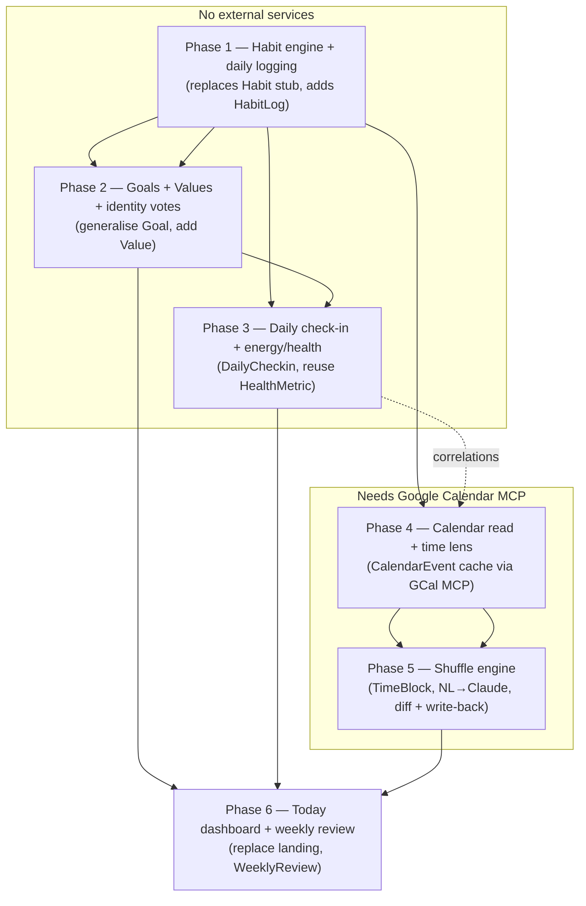
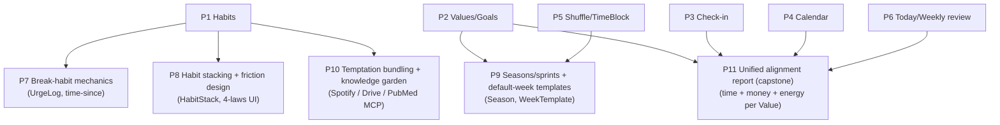

# LifeOS — Habit / Calendar / Goals Ecosystem Roadmap (refined)

## Context

LifeOS is today a finances-only app (Transactions, Budget, Net Worth, Goals, Project BUY).
This roadmap expands it into a systems-based life OS in the spirit of *Atomic Habits*: habits
that vote for an identity, goals/values they roll up to, a reflowable calendar, and reflection
loops tying time + money + energy together — possible because all data lives in one local SQLite
file.

**This document is a refined, codebase-grounded roadmap, not a single PR.** Each phase below is
independently shippable and is scoped to be picked up as its own session/PR. Phases are ordered by
dependency: trackable units first, the calendar shuffle (the "magic") last, once foundations are
solid. The schema already reserves stubs (`Habit`, `Task`, `HealthMetric` in
`prisma/schema.prisma:169-195`) and `src/components/Nav.tsx:27-31` has greyed "Coming soon"
entries (Health / Tasks / Habits).

> **Before writing any code in a build session:** this is a modified Next.js (16.2.9) per
> `AGENTS.md` — read the relevant guide in `node_modules/next/dist/docs/` and heed deprecation
> notices before touching routes/pages.

## The established vertical-slice pattern (reuse, don't reinvent)

Every finance feature is the same slice. Confirmed reference files for each layer:

- **DB** — one Prisma model per concept in `prisma/schema.prisma`; Prisma 7 + SQLite via the
  better-sqlite3 adapter; singleton `db` from `src/lib/db.ts`. Client generates to
  `src/generated/prisma`. Migrate with `npm run migrate` (`prisma migrate dev`); seed data lives
  in `prisma/seed.ts` (`npm run seed`).
- **API** — `src/app/api/<feature>/route.ts` with an `Input` type, a `normalise()` helper, and
  `POST/PUT/DELETE` returning `NextResponse.json`. `POST` assigns `sortOrder` via
  `db.<model>.aggregate({ _max: { sortOrder } })`. Canonical template:
  `src/app/api/goals/route.ts`.
- **Page** — `src/app/<feature>/page.tsx`, server component, `export const dynamic =
  "force-dynamic"`, `Promise.all([...db queries, getPageInsights("<page>")])`, map rows → `DTO`,
  render `<PageHeader>` + `<InsightSlot insights={slots.<slot>}>` + client component. Reference:
  `src/app/goals/page.tsx`. UI primitives (`PageHeader`, `Card`, `Stat`, `Badge`, `EmptyState`)
  are in `src/components/ui.tsx`.
- **Client** — `src/components/<Feature>Client.tsx` (`"use client"`); mutations via `fetch` to
  the route then `useRouter().refresh()`. Modals wrap in `Portal` (`src/components/Portal.tsx`)
  using `anim-overlay`/`anim-pop`/`card` classes, the local `Field` helper, `inputStyle`, and
  `DatePicker` (`src/components/DatePicker.tsx`). Icons from `lucide-react`; formatting via
  `aud`/`fmtDate` from `src/lib/format`. Reference: `src/components/GoalsClient.tsx`.
- **Insights** — generic `Insight` model. `src/lib/insights/placement.ts` maps a `type` →
  `{ page, slot }` (and powers `isWorthwhile`/`insightHref`); `getPageInsights(page)` in
  `src/lib/insights/store.ts` buckets them. Generation is centralised in
  `computeInsights()` (`src/lib/insights/rules.ts`), which fans out to per-domain modules
  (`goalRules.ts`, `netWorthRules.ts`). `POST /api/insights` **deletes all non-dismissed insights
  and recreates them from `computeInsights()`** — so any new rule module MUST be wired into
  `computeInsights()` or it gets wiped on the next "Generate insights".
- **Nav** — `src/components/Nav.tsx`: move an item from the `future` array (greyed) into
  `primary` (live link) with an `href`.

### Two refinements to the draft's stated approach

1. **Heatmap is CSS, not recharts.** `recharts` (used in `NetWorthChart.tsx`, `Sparkline.tsx`)
   has no calendar-heatmap primitive. Build the GitHub-style heatmap as a CSS-grid of coloured
   cells (same idiom as the existing progress bars in `GoalsClient.tsx`/`page.tsx`). Keep
   `recharts` for true time-series/bar charts (Phase 3 sparkline, Phase 4 time-by-value).
2. **New insight pages must be registered.** `InsightPage` in `placement.ts:5` is currently
   `"budget" | "goals" | "net-worth"`. Any phase adding insights to a new page must extend that
   union, add `placement()` cases for the new `type` values, and (if they should deep-link or
   roll up to the dashboard) handle them in `insightHref`/`isWorthwhile`.

## Data-model spine (the Atomic Habits hierarchy)

```
Value ─< Goal (existing, generalised) ─< Habit ─< HabitLog
   └──────────────< everything rolls up to a Value for alignment scoring
HabitStack · DailyCheckin (energy/mood) · CalendarEvent (cached) · TimeBlock (+rigidity) · WeeklyReview
```

## Build order & dependencies



Phases 1–3 need no external services. Phases 4–5 depend on the Google Calendar MCP being
connected. Each phase ends with its own migration + PR.

---

## Phase 1 — Habit engine + daily logging (foundation)

A working `/habits` page where Riley defines habits and checks them off daily, with streaks and a
heatmap. Self-contained; ships value immediately.

- **Schema** (`prisma/schema.prisma`) — replace the `Habit` stub; add `HabitLog`:
  - `Habit`: `name`, `identityStatement?`, `type` (build|break), `cadence`
    (daily|weekly_count|weekdays), `targetCount?` (Int, for weekly_count), `weekdays?` (CSV
    "1,2,3" for the weekdays cadence), 4-laws fields `cue?`/`craving?`/`response?`/`reward?`,
    `twoMinVersion?`, `archived` (Boolean @default(false)), `sortOrder` (Int @default(0)),
    `createdAt`. (`goalId?`/`valueId?` are added in Phase 2 — leave out now.)
  - `HabitLog`: `habitId` (relation, onDelete: Cascade), `date` (DateTime), `status`
    (done|partial|skipped), `value?` (Float, quantified), `notes?`, `@@unique([habitId, date])`,
    `@@index([habitId])`.
  - Run `npm run migrate`; client regenerates to `src/generated/prisma`.
- **API** — `src/app/api/habits/route.ts` (CRUD on habits, mirror `goals/route.ts`:
  `Input`+`normalise()`+`sortOrder` via aggregate) and `src/app/api/habits/log/route.ts` (`POST`
  upserts a `(habitId,date)` log — `db.habitLog.upsert` on the unique key; supports toggle-done
  and clearing).
- **Lib** — `src/lib/habits.ts`: cadence-aware `isDueToday(habit, date)`, `currentStreak`,
  `completionRate(window)`, and `neverMissTwice` detection (two consecutive due-day misses).
  Use `date-fns` (already a dep). Keep these pure so the page and any future insight rule reuse
  them.
- **Page + client** — `src/app/habits/page.tsx` (server, `force-dynamic`, fetch habits + logs +
  `getPageInsights("habits")`, map → DTO) + `src/components/HabitsClient.tsx`: today's due habits
  with one-tap check-off, per-habit streak, CSS-grid heatmap, add/edit modal via `Portal`
  (clone the `GoalModal` structure, including the 4-laws fields).
- **Nav** — move `{ label: "Habits", icon: Repeat }` from `future` into `primary` with
  `href: "/habits"` in `src/components/Nav.tsx`.
- **(Optional) seed** — add a couple of sample habits to `prisma/seed.ts`.

**Verify:** create a daily habit, check it off across several days → streak increments; miss a
day → "never miss twice" surfaces; reload → persists. Repeat for a `weekly_count` habit to
exercise cadence logic.

---

## Phase 2 — Goals & Values generalisation + identity votes

Lift Goals out of pure-finance, introduce Values, connect habits upward so each check-off is a
"vote" for an identity.

- **Schema**: new `Value` model (`name`, `description?`, `sortOrder`, `createdAt`). Generalise
  `Goal`: add `valueId?`, `kind` (financial|habit|outcome, `@default("financial")`),
  `leadingHabitIds?` (CSV, mirroring the `linkedBucket` CSV convention). Add `Habit.goalId?` +
  `Habit.valueId?` now. **Keep `linkedBucket`/`targetAmount` and `currentFromBuckets`
  (`api/goals/route.ts:24`) untouched** so existing finance goals migrate cleanly (all new
  columns nullable / defaulted).
- **API/Page**: new `/values` slice (full vertical pattern). Extend `api/goals/route.ts`
  `normalise()` to persist `valueId`/`kind`/`leadingHabitIds`, and the `/goals` page + modal to
  set them. Add a "vote counter" to `/habits` ("12 votes for *financially disciplined* this
  week") computed from `HabitLog` via `src/lib/habits.ts`.
- **Cross-module win**: financial goals keep auto-reading their lagging metric from net-worth
  buckets (`currentFromBuckets`); a habit goal reads its leading metric from `HabitLog`. The
  property-by-27 goal is the worked example.

**Verify:** create a Value, attach goals + habits, confirm the vote counter reflects logs and the
property goal still auto-syncs its balance from net-worth.

---

## Phase 3 — Daily check-in + energy/health layer

The hidden variable: a 3-tap daily check-in that later explains habit/spend patterns.

- **Schema**: `DailyCheckin` (`date` @unique, `energy` 1-5, `mood` 1-5, `sleepHours?`, `note?`).
  Keep the reserved `HealthMetric` stub for imported series (Apple Health / Oura CSV — reuse the
  bank-import pattern under `src/lib/banks` + `src/app/api/import`).
- **API/Page**: `src/app/api/checkin/route.ts` (upsert by `date`). The check-in widget is hosted
  on `/today` (Phase 6); ship a small history sparkline (`recharts`, like `Sparkline.tsx`) now.
- **Insight hook**: add a `correlationRules.ts` module wired into `computeInsights()` emitting
  `type: "correlation"` (e.g. "gym weeks ↔ higher savings rate"); register placement + extend
  `InsightPage` if it surfaces on `/today`.

**Verify:** submit check-ins for several days → persist + sparkline; generate insights and
confirm a `correlation` insight appears against existing finance/habit data.

---

## Phase 4 — Calendar read + time-allocation lens

Pull Google Calendar into a local cache: "where did my time actually go?" — the time analogue of
the spending view.

- **MCP**: use the Google Calendar MCP (`list_calendars`, `list_events`) to sync into a local
  `CalendarEvent` cache: `externalId` @unique, `calendarId`, `title`, `start`, `end`, `valueId?`,
  `goalId?`, `rigidity`, `raw` (JSON payload). Local-first: the app reads the cache, syncs on
  demand.
- **Lib**: `src/lib/calendar.ts` — sync routine, week bucketing (`date-fns`), tag events →
  values/goals.
- **Page**: `/calendar` — week view + time-by-value breakdown chart (`recharts` bar/pie like
  `NetWorthChart.tsx`); manual rigidity/value tagging per event (modal via `Portal`).

**Verify:** run a sync → this week's events cache locally; tag a few against values; the
time-allocation chart renders.

---

## Phase 5 — The shuffle engine (the magic)

Reflow flexible/elastic blocks around fixed ones based on each week's demands, as an approved
diff written back to Google Calendar. Built last, on solid foundations.

- **Schema**: `TimeBlock` — `title`, `rigidity` (fixed|flexible|elastic|fluid), `window`
  (allowed days/times, JSON), `durationMin`, `minChunkMin`, `energyProfile` (high|low|any),
  `ordering`/`buffer`, `habitId?` (habit blocks first-class), `theme?`.
- **Flow**: (1) NL weekly-demand input → Claude (`claude-opus-4-8` via `@anthropic-ai/sdk`, same
  client as `src/lib/insights/claude.ts`) parses into constraint adjustments; (2) a solver in
  `src/lib/shuffle.ts` reflows blocks around `fixed` events respecting energy/ordering/themes and
  **guarantees habit time survives**; (3) present a **diff** ("moved gym Tue→Wed, dropped
  Spanish") for approval; (4) on approval write via `update_event`/`create_event`. **Never
  silently overwrite** — store a pre-shuffle snapshot for one-click undo.
- **Tiering**: v1 = "find a slot for this habit" button; v2 = full reflow proposal + write-back.

**Verify:** define blocks + a busy-week prompt → sensible proposed diff; approve → events update
in Google Calendar; undo → restoration confirmed.

---

## Phase 6 — Unified "Today" dashboard + weekly review loop

The connective surface + the feedback ritual that makes it a *system*.

- **Page**: replace the finance-only landing (`src/app/page.tsx`) with a "Today" view: habits
  due, today's calendar, top goal, the daily check-in (Phase 3), one finance number (reuse
  `getLatestNetWorth`/`getMonthFlow` from `src/lib/queries`).
- **Weekly review**: `WeeklyReview` model + an auto-generated digest (habit completion, time vs.
  intentions, goal pace) via the insight pipeline (new rule module wired into
  `computeInsights()`, `type: "weekly_review"`); optionally scheduled via the `/schedule` or
  `/loop` skills, with `PushNotification` for nudges.
- **Nav polish**: regroup the sidebar into "Finances / Habits / Time / Reflect" sections; change
  the `Nav.tsx:48` subtitle "Finances" → "LifeOS" and update `layout.tsx` metadata.

**Verify:** load `/today` → all widgets populate from real data; generate a weekly review digest
→ it summarises the week accurately.

---

# Extension phases (7–11) — previously "cross-cutting / later", now scheduled

These build on the foundations above and are sequenced by dependency. Same vertical-slice
pattern; each is its own migration + PR.



## Phase 7 — Break-habit mechanics (depends P1)

`Habit.type` already carries `build|break` from Phase 1; this gives break habits their own loop.

- **Schema**: `UrgeLog` (`habitId` relation cascade, `timestamp`, `intensity?` 1-5, `gaveIn`
  Boolean, `trigger?`, `note?`, `@@index([habitId])`).
- **Lib**: extend `src/lib/habits.ts` with `timeSince(habit)` ("time since last slip", from the
  latest `gaveIn` log or `createdAt`) and urge stats.
- **API/page**: `src/app/api/habits/urge/route.ts`; on `/habits`, break habits render a
  "time since" counter + "log urge" / "I slipped" buttons instead of the build check-off.

**Verify:** log urges and a slip → the time-since counter resets on the slip and the urge history
persists.

## Phase 8 — Habit stacking + friction design (depends P1)

The cue/craving/response/reward + `twoMinVersion` fields already exist on `Habit` from Phase 1.

- **Schema**: `HabitStack` (`name`, `sortOrder`) + a join `HabitStackItem` (`stackId`,
  `habitId`, `order`) so a habit can live in multiple chains.
- **UI**: a stack builder ("After I **X**, I will **Y**") that orders the chain; today's due
  habits render grouped by stack. Surface the 4-laws fields in the habit modal as friction-design
  prompts (make it obvious/attractive/easy/satisfying — inverse for break habits).

**Verify:** build a 3-habit stack, reorder it, and confirm `/habits` renders the chain in order
and persists.

## Phase 9 — Seasons/sprints + default-week templates (depends P2; P5 for default week)

- **Schema**: `Season` (`name`, `start`, `end`, `theme?`, `valueId?`, `goalIds?` CSV) — a 6–12wk
  focus window; `WeekTemplate` (`name`, `blocks` JSON of `TimeBlock` specs).
- **Page**: a `/seasons` slice; an "apply default week" action that materialises `TimeBlock`
  rows from a template (reuses the Phase 5 `TimeBlock` model).

**Verify:** create a season, apply a default-week template → `TimeBlock` rows appear for the
week; the active season shows on `/today`.

## Phase 10 — Temptation bundling + knowledge garden (depends P1; external MCPs)

- **Temptation bundling**: pair a habit with a reward (e.g. a Spotify playlist) via
  `Habit.rewardBundle?` (link/URI). Use the Spotify MCP if connected; otherwise store the link.
- **Knowledge garden**: a `Reference` model (`title`, `source`, `url`, `valueId?`/`goalId?`,
  `raw` JSON) ingested from Drive/PubMed MCPs into a local cache — same local-first pattern as
  `CalendarEvent` (Phase 4).

**Verify:** attach a reward to a habit and confirm it surfaces at check-off time; ingest a couple
of references and confirm they link to a Value.

## Phase 11 — Unified time + money + energy alignment report (capstone, depends P2/P3/P4/P6)

The payoff only LifeOS can deliver — everything in one SQLite file.

- **Lib**: `src/lib/alignment.ts` joins `HabitLog` (votes), `CalendarEvent` (time per value),
  `Transaction` (money per value/category), and `DailyCheckin` (energy), scoring each `Value` on
  time + money + energy alignment.
- **Page/insight**: an `/align` report (or a weekly-review section) with a Claude narrative
  (reuse the `composeNarrative` pattern in `src/lib/insights/claude.ts`); insight
  `type: "alignment"` wired into `computeInsights()` and registered in `placement.ts`.

**Verify:** with habits, calendar, transactions, and check-ins populated, generate the report and
confirm each Value's time/money/energy scores reconcile with the underlying data.

---

## Decisions captured / open questions

- **Phase 1 ships the full cadence model** (daily | weekly_count | weekdays) with cadence-aware
  due/streak logic from the start.
- **Automation philosophy**: keep the finances module's advisory, approve-before-act stance —
  especially for calendar writes in Phase 5 (diff + undo, never silent overwrite). Confirm per
  phase at build time.
- Each phase is its own migration + PR. New insight rule modules must be wired into
  `computeInsights()` or they're wiped by the next regenerate.
